# Portfolio

AI를 활용한 제품·서비스·교육 콘텐츠를 기획하고 직접 구현합니다. 소스는 비공개, 구조와 설계 판단만 공개합니다.

**[제조업 AX 강의](#제조업-ax-강의--엑셀-ai--온톨로지)** · **[리허설 랩](#리허설-랩--3d-발표-연습-공간)** · **[밤의 작은 출판사](#밤의-작은-출판사--ai-대화-출판-워크숍)** · **[NEXT JOB WORLD](#next-job-world--2040-미래-직업-탐험-게임)**

---

## 제조업 AX 강의 — 엑셀 AI × 온톨로지

   

> 같은 코드, 다른 뜻. 엑셀 AI로 뜻을 맞추고, 온톨로지로 관계를 이으면, 부서를 건너는 질문에 답할 수 있다.

품질·생산·생산관리·IT 실무자 및 AX 담당자 대상. 강의 기획안 · 15분 시연 시나리오 · 강의 스크립트 · 실습 데이터 · 쇼츠 영상까지 직접 기획·제작했습니다.

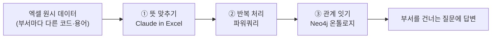
```mermaid
flowchart LR
  A["엑셀 원시 데이터<br/>(부서마다 다른 코드·용어)"] --> B["① 뜻 맞추기<br/>Claude in Excel"]
  B --> C["② 반복 처리<br/>파워쿼리"]
  C --> D["③ 관계 잇기<br/>Neo4j 온톨로지"]
  D --> E["부서를 건너는 질문에 답변"]
```

| 산출물 | 상태 |
|---|---|
| 강의 기획안 · 시연 시나리오 · 스크립트 | v4 (최종) |
| 실습 데이터 (엑셀 · JSON) | 완성 |
| 쇼츠 영상 · 포스터 | 완성 |

<a href="assets/lecture-shorts-v4.mp4">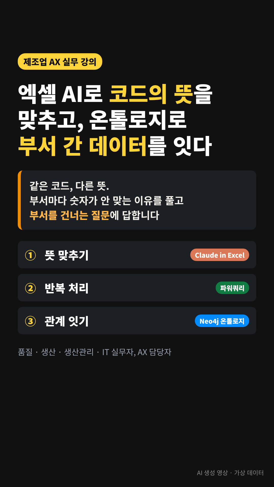</a>
 ▲ 클릭하면 쇼츠 영상(60초) 재생

<b>쇼츠 스토리보드 펼쳐보기 (13컷)</b>

 

| | | | |
|---|---|---|---|
| 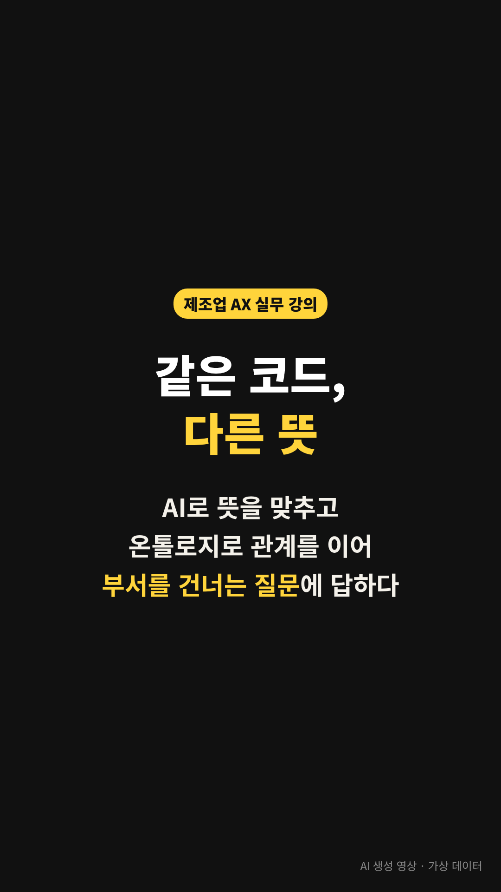 | 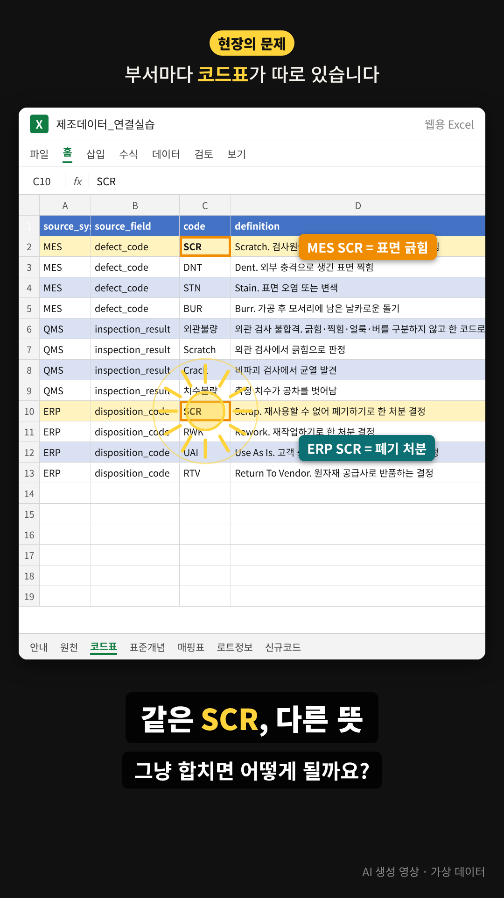 | 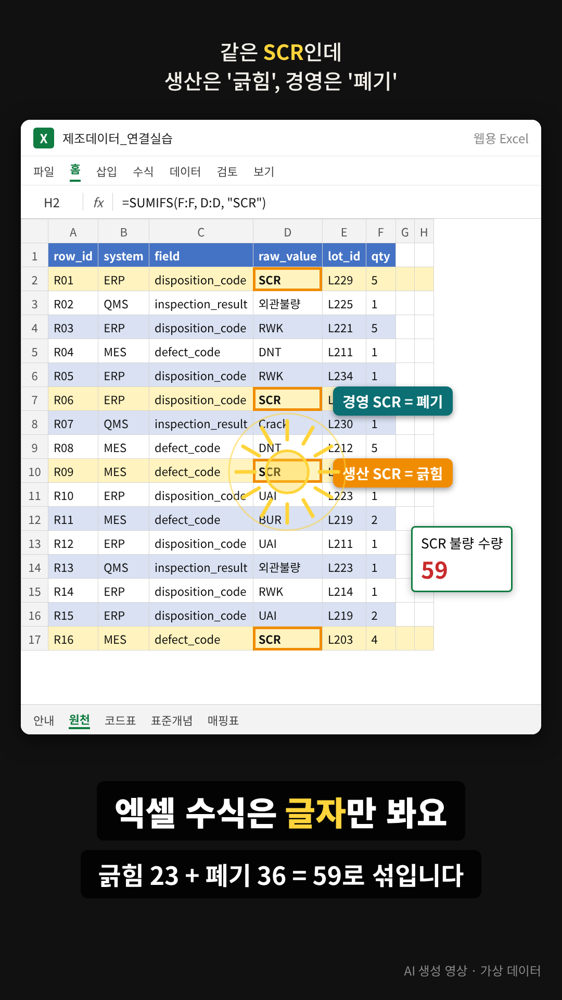 | 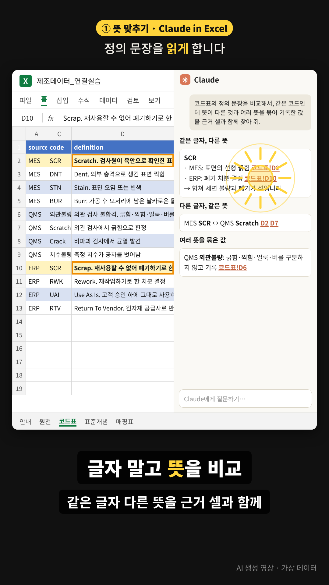 |
| 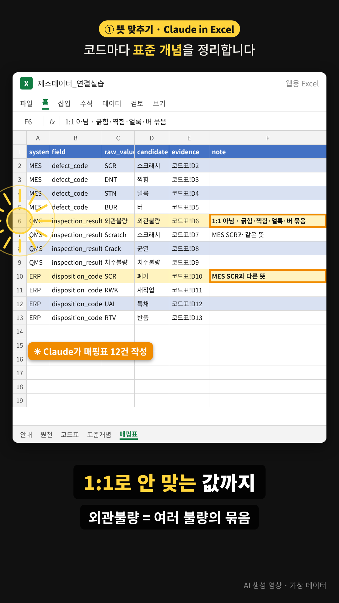 | 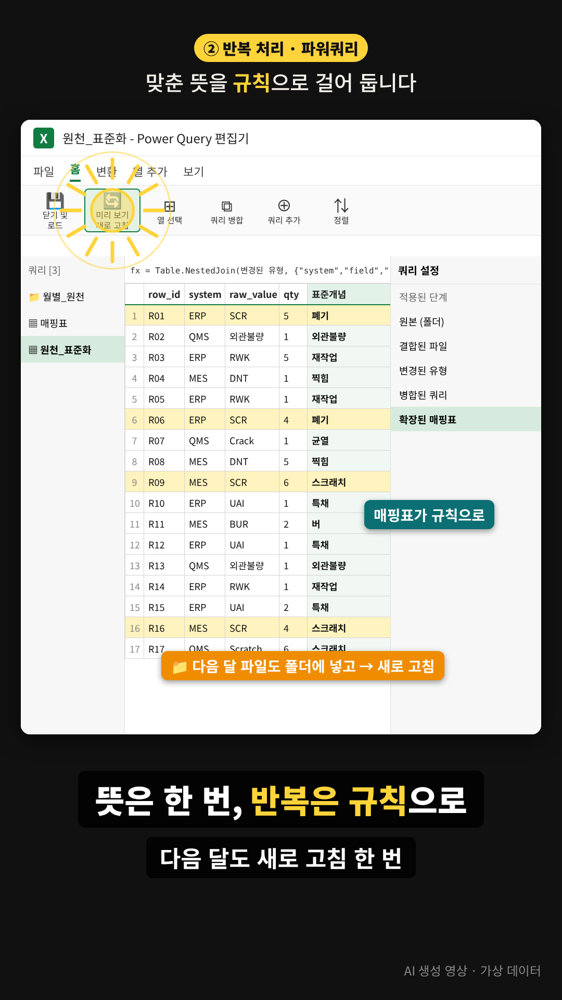 | 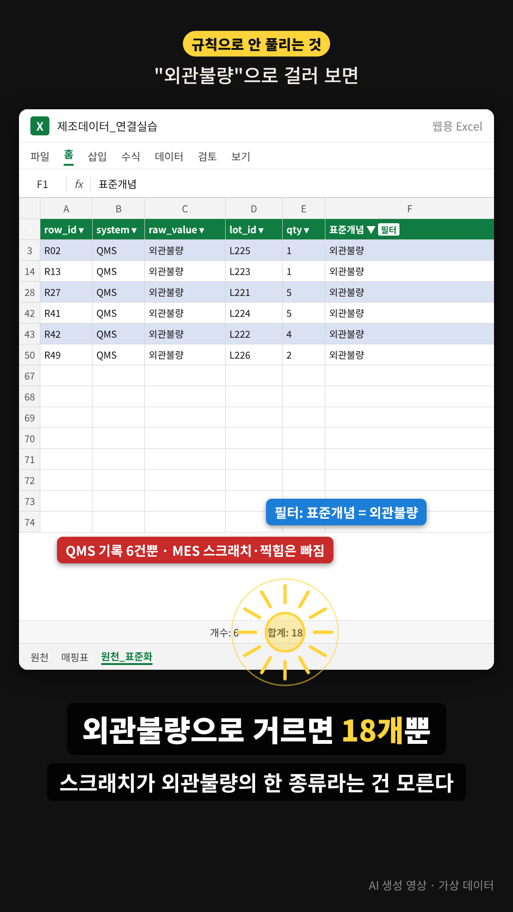 | 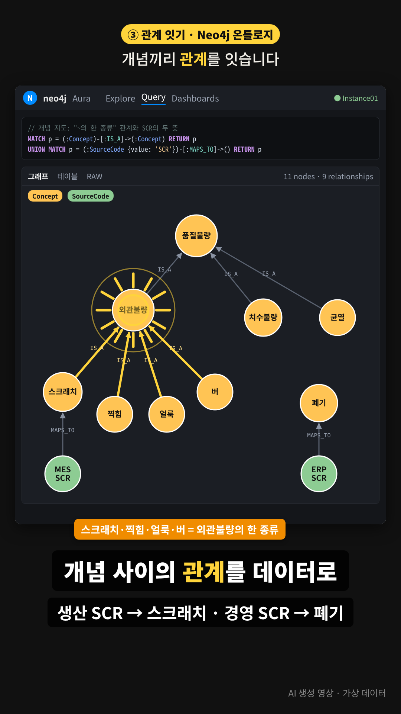 |
| 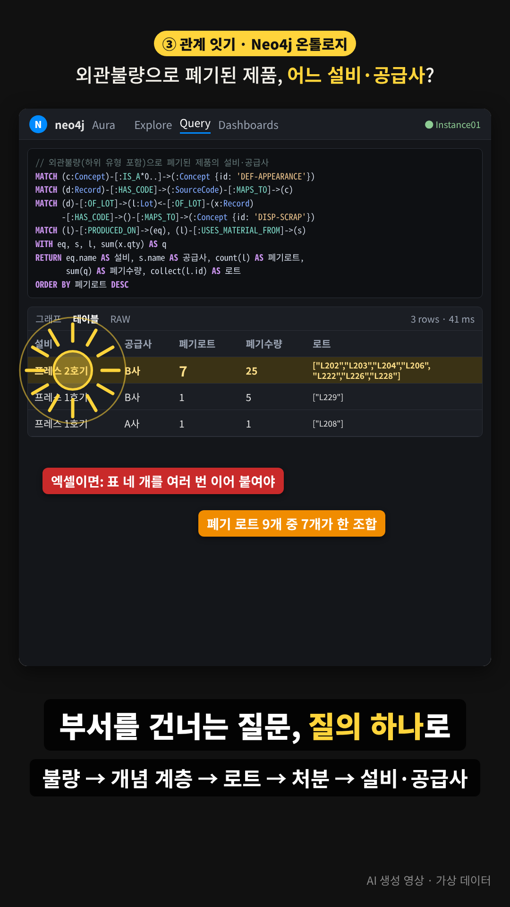 | 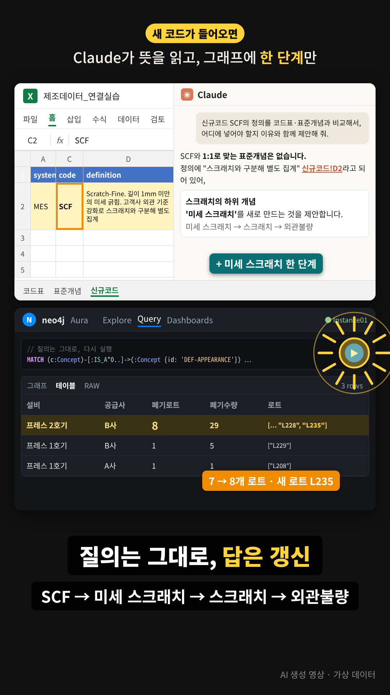 | 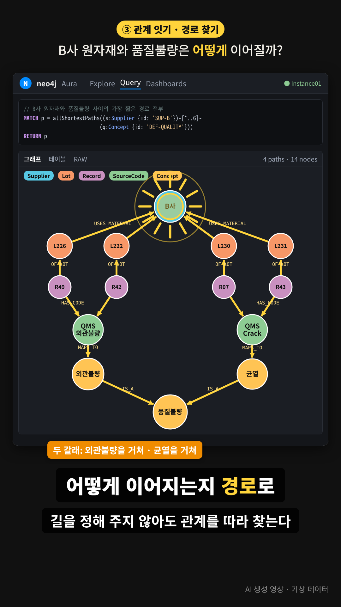 | 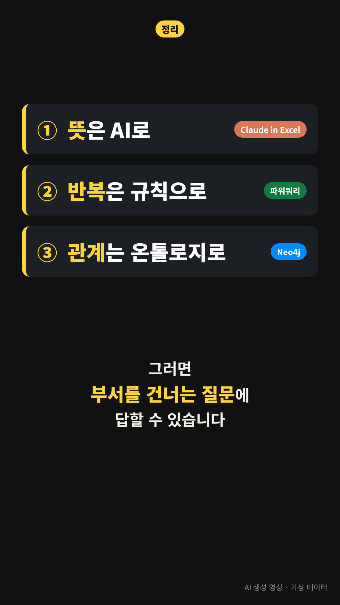 |
| 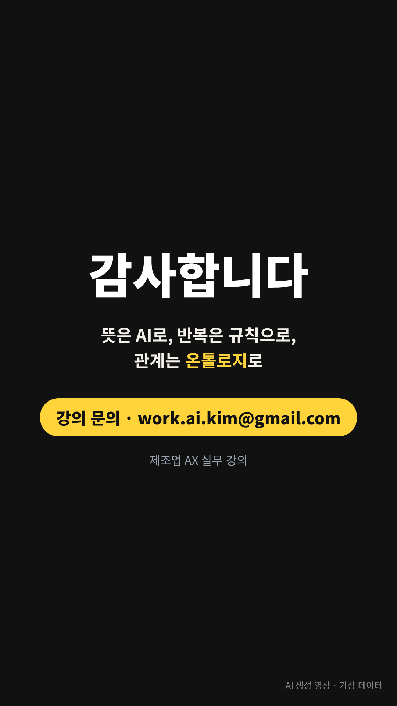 | | | |

---

## 리허설 랩 — 3D 발표 연습 공간

    

> 3D 가상 발표장에서 먼저 발표하고, 녹음을 다시 들은 뒤, 원할 때만 실제 발언에 근거한 AI 청중 질문에 답한다.

"발표 실력을 점수로 매기는 도구"가 아니라 "편하게 반복 연습할 수 있는 공간"을 목표로 기획했습니다.

**제품 원칙**

| 원칙 | 의미 |
|---|---|
| 발표가 먼저 | AI가 발표 중 끼어들거나 침묵으로 자동 종료시키지 않음 |
| 질문은 선택 | 안 받아도 정상 연습으로 집계 |
| 근거 없는 질문 금지 | AI 질문은 실제 전사에서 근거가 확인된 것만 저장 |
| 평가 표현 금지 | 억양·표정·자신감·점수·순위 없이 전사 텍스트만 분석 |

**아키텍처** — 서버 프레임워크 없이 직접 구현, 제공자는 전부 어댑터로 교체 가능

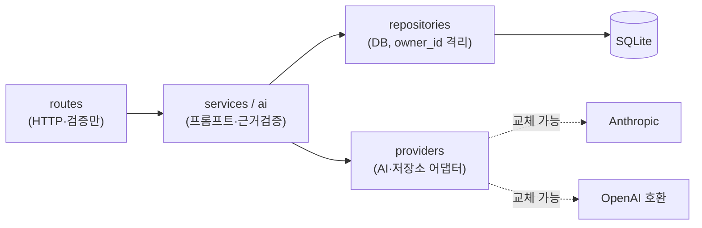
```mermaid
flowchart LR
  R["routes<br/>(HTTP·검증만)"] --> S["services / ai<br/>(프롬프트·근거검증)"]
  S --> REPO["repositories<br/>(DB, owner_id 격리)"]
  S --> P["providers<br/>(AI·저장소 어댑터)"]
  REPO --> DB[(SQLite)]
  P -.교체 가능.-> AI1["Anthropic"]
  P -.교체 가능.-> AI2["OpenAI 호환"]
```

**데이터 모델** — 모든 테이블에 `owner_id`, 모든 쿼리가 이걸로 격리

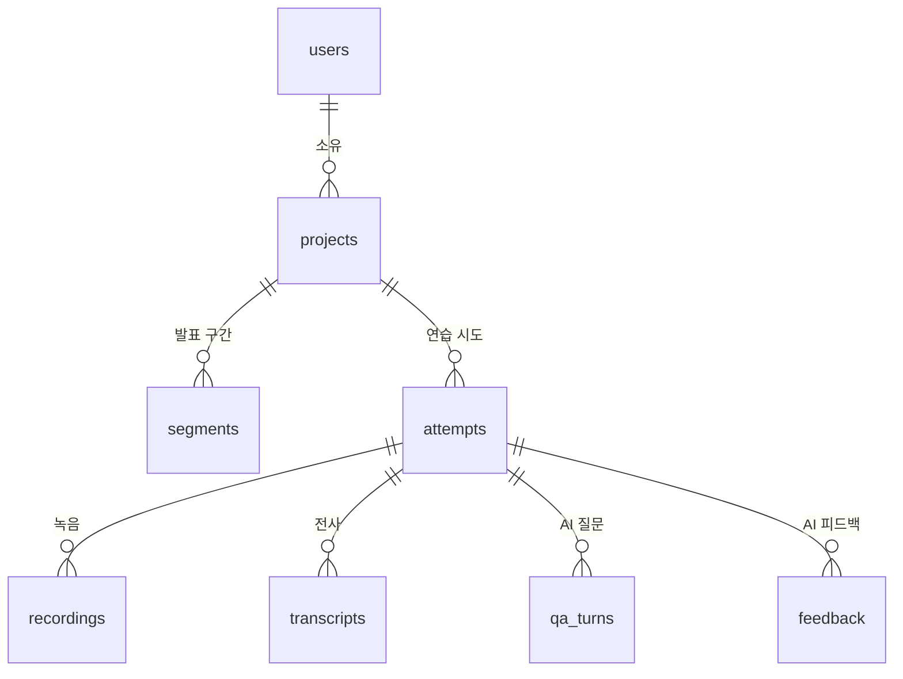
```mermaid
erDiagram
  users ||--o{ projects : "소유"
  projects ||--o{ segments : "발표 구간"
  projects ||--o{ attempts : "연습 시도"
  attempts ||--o{ recordings : "녹음"
  attempts ||--o{ transcripts : "전사"
  attempts ||--o{ qa_turns : "AI 질문"
  attempts ||--o{ feedback : "AI 피드백"
```

**설계에서 풀어낸 문제**

| 문제 | 해법 |
|---|---|
| 녹음 중 네트워크가 끊기면? | 청크 단위 업로드, 서버가 확인한 `last_seq`만 신뢰(클라이언트 주장 안 믿음) |
| 정책이 바뀌면 과거 기록도 바뀌나? | `attempts.snapshot_json`에 시작 시점 조건을 통째로 복제 보존(불변 스냅샷) |
| AI 제공자를 바꾸고 싶으면? | 인터페이스 구현 파일 1개 + 등록 1줄. 서비스·화면 코드는 무수정 |
| 녹음을 영원히 보관해야 하나? | 녹음 원본은 30일 후 자동 만료, 전사·질문·피드백 텍스트는 무기한 보관 |

**상태**: 가입·로그인, 3D 공간 입장, 녹음·재생·북마크, 프로젝트/구간 관리 구현 및 검증 완료(타입체크·빌드·서버 테스트 통과). AI 연결은 어댑터 구조로 분리되어 키 연결 즉시 동작.

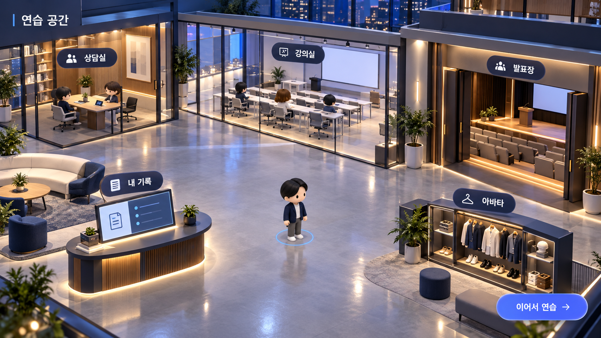 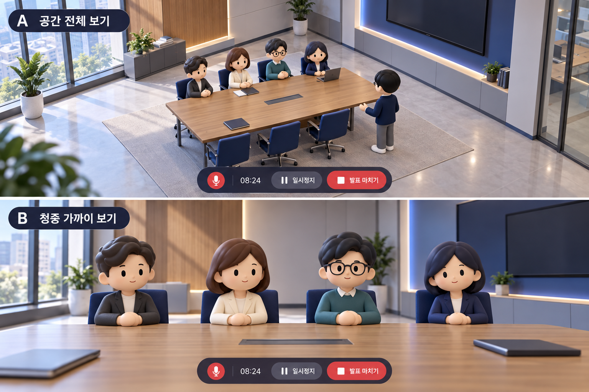

실제 화면이 아닌 디자인 시안 — 현재 화면을 이 디자인으로 교체 예정

---

## 밤의 작은 출판사 — AI 대화 출판 워크숍

    

> 말로 꺼낸 이야기를 AI와의 대화로 끌어내고, 여러 답변을 종합해 한 편의 글로 완성해, 참가자들의 글을 한 권의 책으로 발행한다.

성인 대상 글쓰기 워크숍용. 참가자는 글쓰기 실력을 평가받지 않고, 편하게 말한 내용을 AI가 독립적으로 읽히는 글로 재구성해줍니다.

**제품 설계 포인트**

| 포인트 | 구현 |
|---|---|
| 질문 반복 방지 | 첫 질문은 매번 다른 관점 재료로 생성, 이후 질문은 직전 답변의 실제 표현을 짚어 되물음 |
| 없는 사실 방지 | AI가 대화에 없던 숫자·인용을 쓰면 자동으로 "확인해 주세요" 표시 |
| 발행본 불변성 | 발행 시점 원고를 스냅샷으로 고정, 이후 수정이 기존 발행본을 바꾸지 않음 |

**아키텍처** — 화면 테마와 핵심 로직을 구조적으로 분리

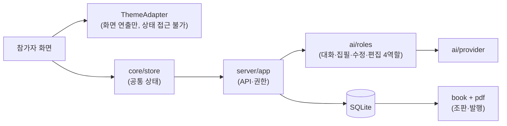
```mermaid
flowchart LR
  UI["참가자 화면"] --> THEME["ThemeAdapter<br/>(화면 연출만, 상태 접근 불가)"]
  UI --> STORE["core/store<br/>(공통 상태)"]
  STORE --> API["server/app<br/>(API·권한)"]
  API --> ROLES["ai/roles<br/>(대화·집필·수정·편집 4역할)"]
  ROLES --> PROVIDER["ai/provider"]
  API --> DB[(SQLite)]
  DB --> BOOK["book + pdf<br/>(조판·발행)"]
```

**데이터 모델** — 진행 중 구성안과 발행 스냅샷을 분리해 "발행 후 조용한 변경"을 원천 차단

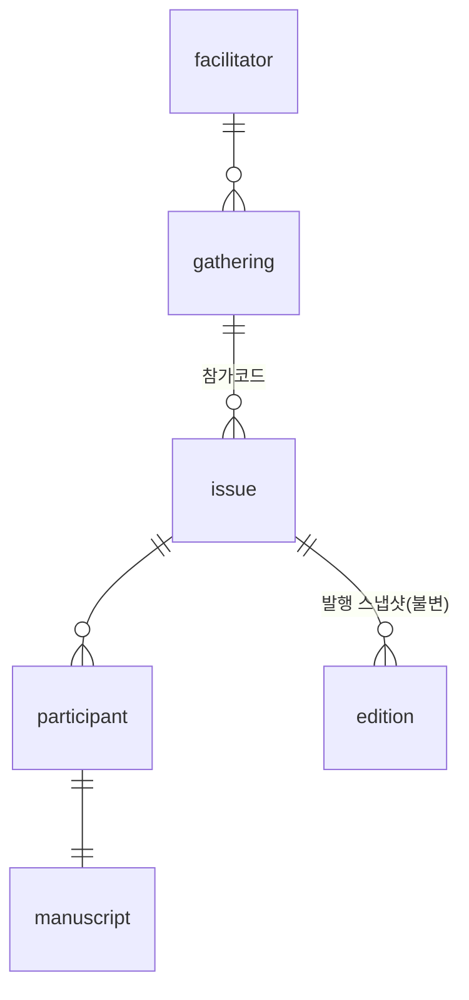
```mermaid
erDiagram
  facilitator ||--o{ gathering : ""
  gathering ||--o{ issue : "참가코드"
  issue ||--o{ participant : ""
  participant ||--|| manuscript : ""
  issue ||--o{ edition : "발행 스냅샷(불변)"
```

**검증**: 서버 계약 테스트 15개 + Playwright E2E 32개 — 권한 경계, 타이머 복원, 테마 전환 시 상태 보존, PDF 페이지 분할·목차 정합성 포함.

**상태**: 입장 → 대화 → 집필 → 수정 → 제출 → 진행자 편집 → 발행 → PDF 전 과정 구현 및 로컬 검증 완료. 실사용 배포는 준비 중.

| | | |
|---|---|---|
| 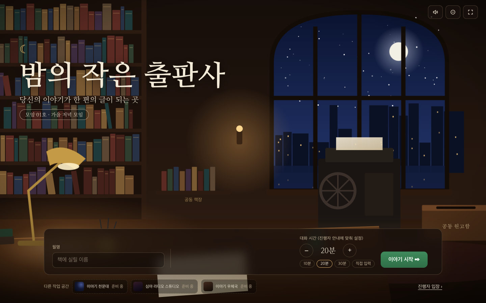 | 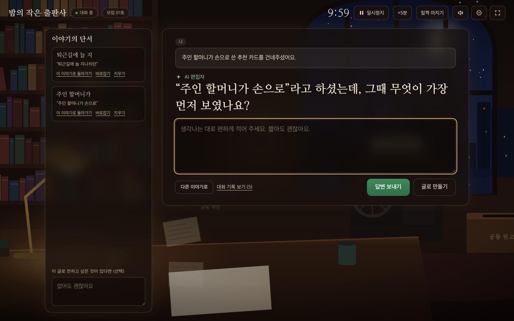 | 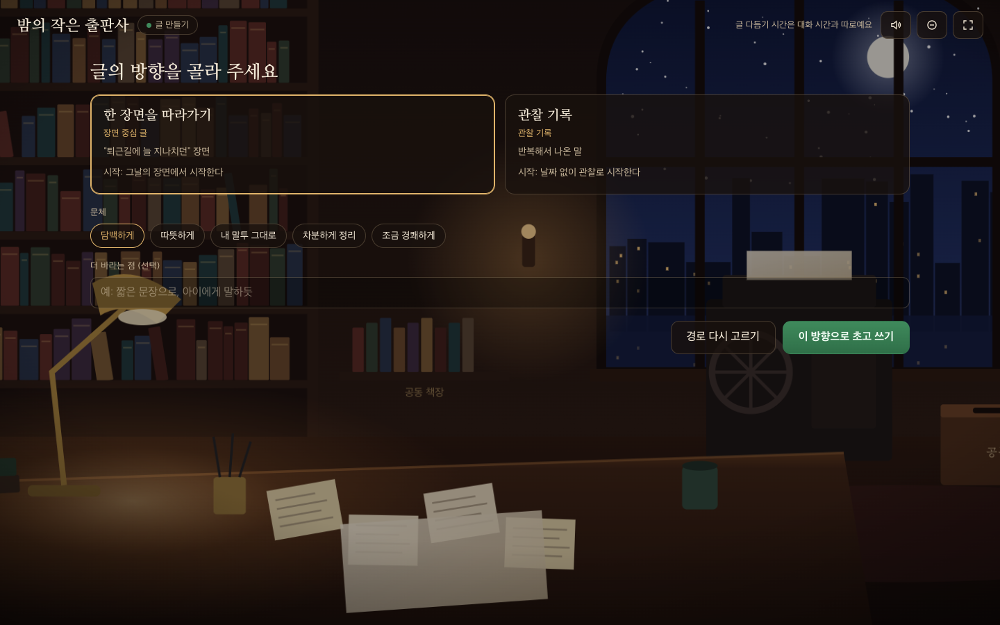 |
| 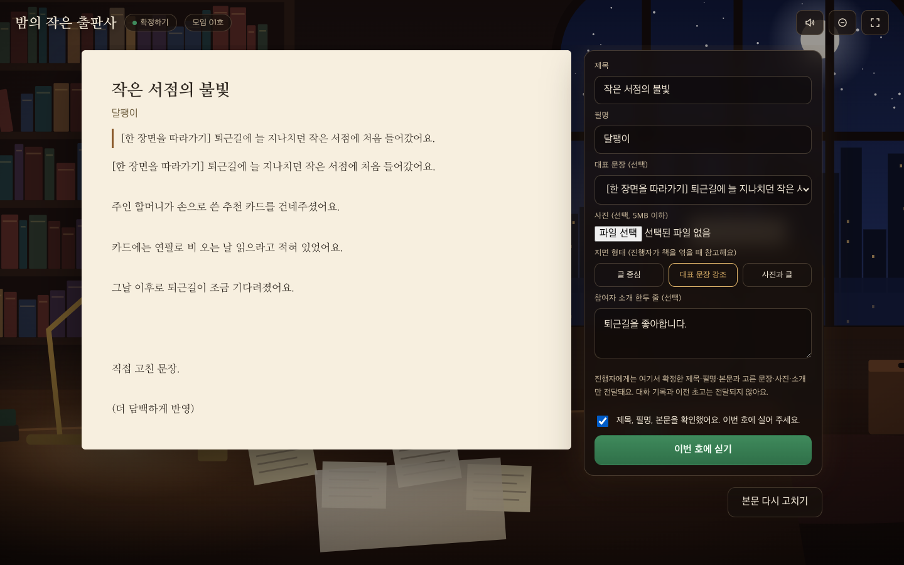 | 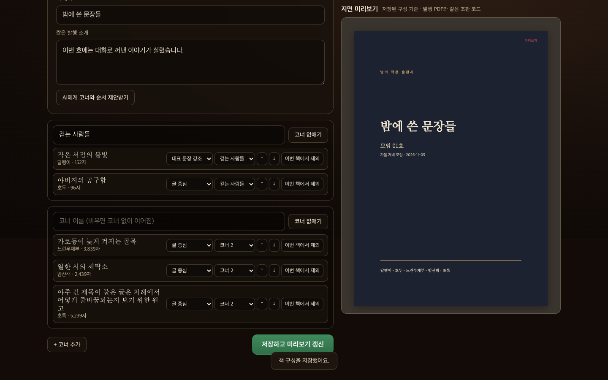 | 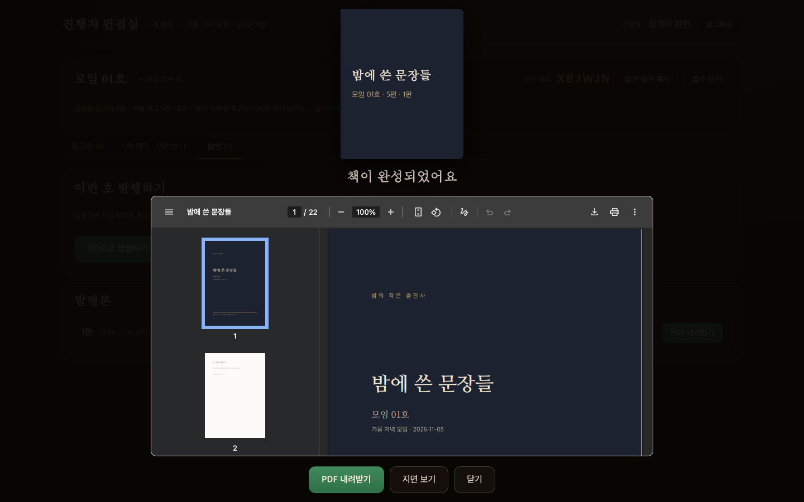 |

---

## NEXT JOB WORLD — 2040 미래 직업 탐험 게임

   

> 직업 이름이 사라진 2040년, AI 가이드 NOVA와 함께 여섯 개 미래 도시 구역을 탐험하며 세상에 필요한 새 역할을 발명한다.

북일고 고등학생 대상 "미래 직업 창조 프로젝트" 수업을 위해 기획부터 제작, 실제 수업 운영까지 진행한 교육 게임입니다.

**기획 — 수업안에서 게임으로**

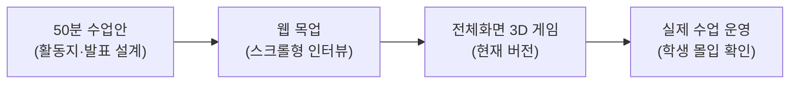
```mermaid
flowchart LR
  A["50분 수업안<br/>(활동지·발표 설계)"] --> B["웹 목업<br/>(스크롤형 인터뷰)"] --> C["전체화면 3D 게임<br/>(현재 버전)"] --> D["실제 수업 운영<br/>(학생 몰입 확인)"]
```

원래는 코딩 수업을 대체할 50분짜리 오프라인 활동(활동지 · 발표 대본)으로 설계했고, 이를 그대로 게임화했습니다. 핵심 질문은 하나입니다 — *"내일부터 세상의 모든 직업이 사라진다면, 당신은 어떤 새 직업을 만들겠는가?"* 6개 구역은 디자인 씽킹 프로세스를 그대로 따라갑니다.

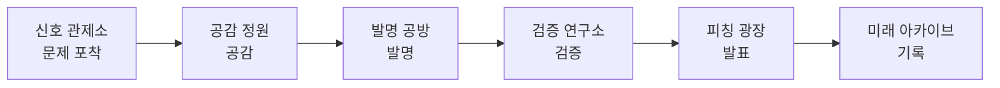
```mermaid
flowchart LR
  A["신호 관제소<br/>문제 포착"] --> B["공감 정원<br/>공감"] --> C["발명 공방<br/>발명"] --> D["검증 연구소<br/>검증"] --> E["피칭 광장<br/>발표"] --> F["미래 아카이브<br/>기록"]
```

**교육 설계 원칙** — Project Zero *Take a Stand*, OECD PISA 창의적 사고 프레임워크, 교육용 의사결정 게임 *Quandary*의 구조를 참고해 수립

| 원칙 | 적용 |
|---|---|
| 정답 없는 핵심 질문 | 채점이 아니라 "완성된 직업 보기"로 결과를 보여줌 |
| 중간 사건으로 재검토 유도 | 선택 이후 새로운 정보·타인의 반응이 들어와 처음 생각을 다시 검토하게 함 |
| 발표 중심 마무리 | 1분 피칭 + 동료 피드백 질문으로 수업을 마무리 |

**기능**

| 기능 | 설명 |
|---|---|
| 스토리 인트로 | 3단계 내러티브로 세계관 전달 |
| 탐험 지도 | 6개 구역을 isometric 맵에서 선택, 구역별 진행 상태 표시 |
| 구역별 미션 | NOVA와의 질의응답형 대화 — 입력에 따라 다음 내용이 분기 |
| 타이머 | 50분 정식 수업 모드 / 빠른 체험(퀵플레이), 일시정지 · 시간 추가 |
| 결과물 제출 | 완성된 직업 설계서를 인쇄 → PDF 저장, 학생이 직접 패들렛에 제출 |
| 접근성 | 효과음 on/off, 장면 움직임 줄이기, 전체화면 전환 |
| 자동 저장 | 진행 상황을 브라우저에 자동 저장, 중단 후 이어서 가능 |

**설계**

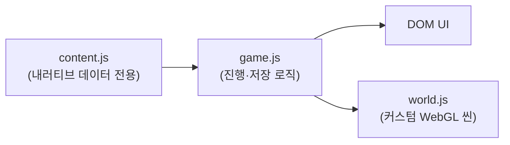
```mermaid
flowchart LR
  CONTENT["content.js<br/>(내러티브 데이터 전용)"] --> ENGINE["game.js<br/>(진행·저장 로직)"]
  ENGINE --> DOM["DOM UI"]
  ENGINE --> WORLD["world.js<br/>(커스텀 WebGL 씬)"]
```

- **콘텐츠와 엔진을 파일 단위로 분리** — `content.js`는 텍스트 데이터만, `game.js`가 진행 로직을 담당. 리허설 랩·매거진의 "표현과 로직 분리" 원칙과 같은 패턴.
- **외부 3D 라이브러리 없이 저폴리 WebGL 씬을 직접 구현**(`world.js` 주석: "self-contained... No network dependencies") — 리허설 랩이 three.js를 쓴 것과 대비되는, 완전 경량화된 선택.
- **서버 없는 완전 정적 사이트** — 실제 네트워크 탭으로 확인: 페이지 로드 후 API 호출이 전혀 없고 정적 JS/CSS 파일만 로드됨. 학생 식별 정보 없이 브라우저에만 진행 상황 저장, 제출은 학생이 직접 PDF로 내려받아 패들렛에 올리는 방식 — 서버에 학생 데이터를 모으지 않는 선택.
- NOVA와의 대화는 실시간 생성이 아니라 **사전 작성된 분기 시나리오**(`content.js`)로 구현 — 가벼운 배포가 가능한 대신, 확장하려면 분기를 직접 추가해야 하는 구조.

**검증**: 기능 테스트(단계 이동 · 타이머 만료 후 답변 보존 · 저장/이어하기 · PDF 제출 흐름) 다수 통과, **실제 수업에 투입해 학생 참여·몰입 확인**.

**홍보 영상 기획** — 60초 숏폼 + 6분 롱폼 필름 트리트먼트 완성(제작 전 검토 단계)

| 타임라인 | 장면 |
|---|---|
| 00:00–00:07 | 미래에 대한 질문 — "지금 꿈꾸는 직업, 미래에도 같은 모습일까?" |
| 00:07–00:17 | 배움과 미래 사이 |
| 00:17–00:27 | 게임으로 만난 미션 |
| 00:27–00:39 | 문제에서 직업으로 |
| 00:39–00:50 | 내 목소리로 발표 |
| 00:50–01:00 | 열린 미래의 질문으로 마무리 |

교사 1인칭 내레이션, 장면별 타임코드·자막·음향 연출까지 샷 단위로 설계했고, **학생 얼굴·음성·이름은 공개 범위가 확인된 자료만 사용**한다는 제작 원칙을 문서에 명시했습니다.

**확장 — 같은 포맷을 다른 주제로** : 실제 수업 후 "인터뷰형 교육 게임"을 하나의 포맷으로 보고, 학교 리부트 · AI 분신 사용계약서 · 외계인을 위한 지구 박물관 등 8개 주제로 설계안을 추가 기획했습니다. 공통 구조는 핵심 질문 6~8개 + 중간 사건 1개 + 재검토 기회 + 생각 변화 시각화.

**상태**: 실제 수업 운영 완료 — [buil-next-job-world.work-ai-kim.chatgpt.site](https://buil-next-job-world.work-ai-kim.chatgpt.site)
